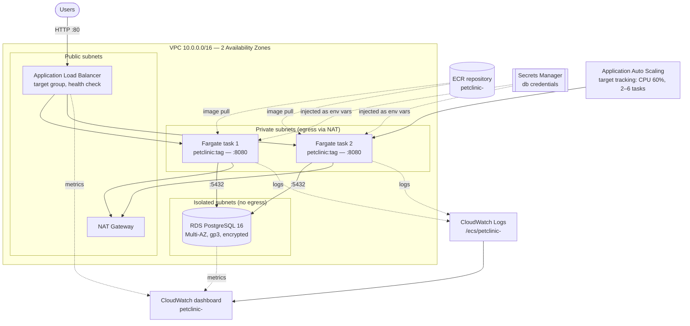

# PetClinic on AWS — Architecture

This directory contains the AWS CDK (TypeScript) definition of the runtime environment for the
Spring PetClinic application. Nothing here changes application code, and nothing is deployed by CI:
the pipeline only runs `cdk synth`.

## Diagram



## Components

| Component | Configuration |
| --- | --- |
| VPC | 2 AZs; public, private-with-egress and isolated subnet tiers (/24 each); 1 NAT gateway; S3 gateway endpoint |
| ECR | `petclinic-<env>`, scan on push, AES-256 encryption, lifecycle rule keeping the last 10 images, `RETAIN` on stack deletion |
| ECS | Fargate cluster with Container Insights; task 1 vCPU / 2 GB; desired count 2; rolling deploys with circuit breaker + rollback; ECS Exec enabled |
| Load balancer | Internet-facing ALB on port 80 forwarding to container port 8080; health check on `/` accepting 200–399, 30 s interval, 2 healthy / 3 unhealthy thresholds; 30 s deregistration delay |
| Autoscaling | Target tracking on service CPU utilization at 60%, min 2 / max 6 tasks, 1 min scale-out and 5 min scale-in cooldowns |
| Database | RDS PostgreSQL 16.4, `db.t4g.medium`, Multi-AZ, isolated subnets, 50 GB gp3 autoscaling to 200 GB, encrypted, 7-day backups, Performance Insights, `postgresql` + `upgrade` logs to CloudWatch |
| Secrets | `DatabaseSecret` generated by CDK and owned by RDS; username/password injected into the task as `POSTGRES_USER` / `POSTGRES_PASS` via `ecs.Secret.fromSecretsManager` (values never appear in the template) |
| Observability | Log group `/ecs/petclinic-<env>` with 1-month retention; dashboard with ALB traffic/latency/5xx, target health, ECS CPU & memory, RDS CPU/connections/storage/memory, and a Logs Insights error widget |

Network isolation: the ALB security group is the only ingress to the task security group, and the task
security group is the only ingress to the database security group. The database subnets have no route
to the internet.

### Application configuration contract

The container receives:

- `SPRING_PROFILES_ACTIVE=postgres`
- `JDBC_URL` / `POSTGRES_URL` — `jdbc:postgresql://<rds-endpoint>:5432/petclinic`
- `POSTGRES_HOST`, `POSTGRES_PORT`, `POSTGRES_DB`
- `POSTGRES_USER`, `POSTGRES_PASS` — resolved from Secrets Manager at task start

The image is pulled from the provisioned ECR repository at the tag passed via
`-c imageTag=<tag>` (default `latest`). Building and pushing that image is out of scope for this
stack; the application itself is unchanged.

## Usage

```bash
cd infra
npm ci
npx cdk synth                       # renders CloudFormation, no AWS account needed
npx cdk synth -c envName=prod -c imageTag=1.2.3
```

Deployment (`cdk deploy`) is intentionally not wired into CI and requires credentials that this
repository does not hold.

## Estimated monthly cost

Steady state: 2 Fargate tasks running continuously, `db.t4g.medium` Multi-AZ, low-to-moderate traffic
(~100 GB/month egress, ~50 GB/month of logs and metrics). On-demand pricing, `us-east-1`,
September 2026 published rates; taxes excluded.

| Service | Assumption | Est. monthly (USD) |
| --- | --- | --- |
| ECS Fargate compute | 2 tasks × (1 vCPU + 2 GB) × 730 h | ~$72 |
| Application Load Balancer | 1 ALB × 730 h + ~10 LCU-hours/day | ~$25 |
| RDS PostgreSQL `db.t4g.medium` | Multi-AZ instance hours (2 × $0.130/h) | ~$95 |
| RDS storage | 50 GB gp3 Multi-AZ (billed both AZs) + backups | ~$14 |
| NAT Gateway | 1 gateway × 730 h + ~50 GB processed | ~$35 |
| Data transfer out | ~100 GB to internet | ~$9 |
| CloudWatch Logs | ~20 GB ingested, 1-month retention | ~$11 |
| CloudWatch metrics/dashboard | Container Insights + custom dashboard | ~$12 |
| Secrets Manager | 1 secret + API calls | ~$0.50 |
| ECR | ~10 GB stored | ~$1 |
| **Total** | | **~$275/month** |

Numbers are estimates for planning only — actual cost depends on region, traffic, autoscaling
behaviour and log volume. Main levers if this needs to be cheaper:

- Single-AZ RDS in non-production environments (−~$50)
- `db.t4g.small` for dev/test (−~$45)
- Fargate Spot or a smaller task size for non-production (−~$35)
- Compute Savings Plans on steady-state Fargate usage (up to −20% on compute)
- Drop the NAT gateway by adding interface endpoints for ECR/Secrets Manager/CloudWatch if outbound
  internet access is not otherwise required (cost depends on endpoint count; roughly break-even at
  4–5 endpoints)
